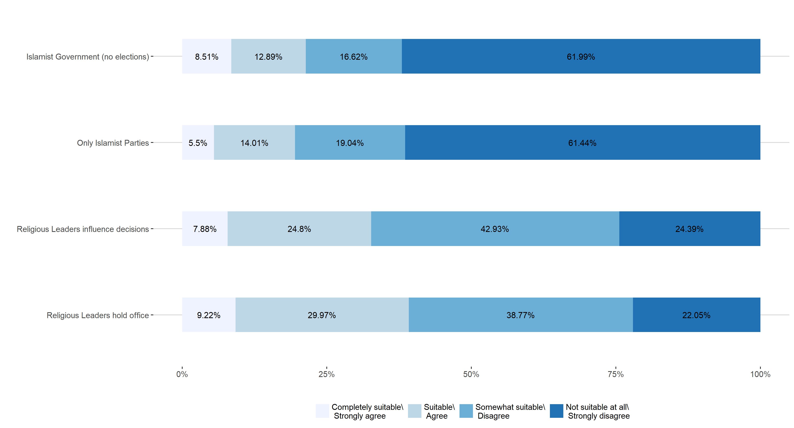
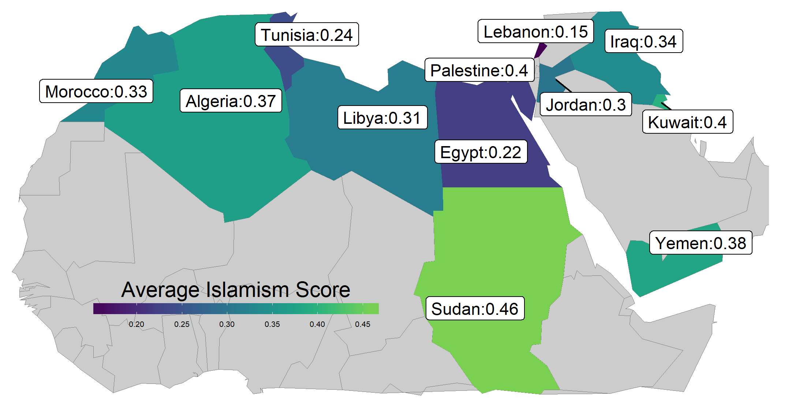
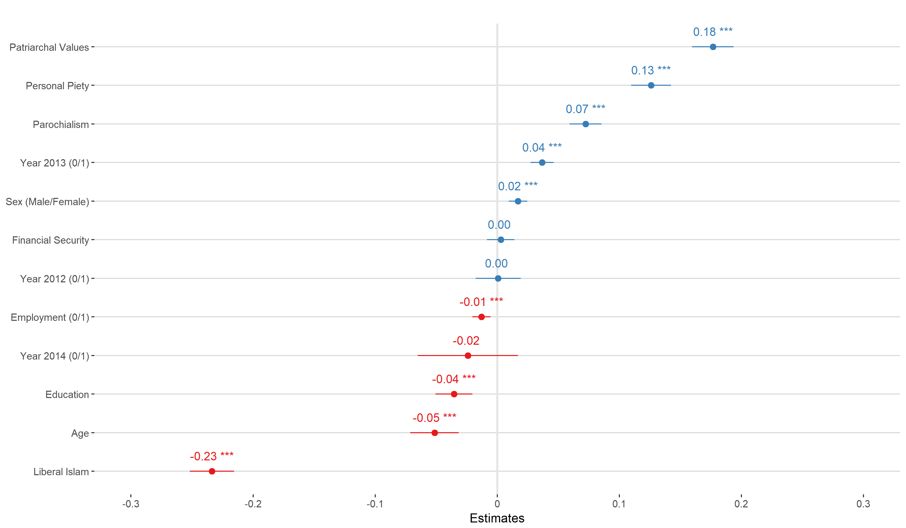

    

```{r xaringan-themer, include = FALSE}
library(xaringanthemer)
# mono_accent(base_color = "#252525", link_color	= "rgb(198, 219, 239)")
```

<style>
.onehundredtwenty {
  font-size: 120%;
   }

<style>
.ninety {
  font-size: 90%;
   }

.eightyfive {
  font-size: 85%;
   }
   
.eighty {
  font-size: 80%;
   }
   
.seventyfive {
  font-size: 75%;
   }
   
.seventy {
  font-size: 70%;
   }
</style>


```{r setup, echo = F, include=F}
# include=FALSE
options(htmltools.dir.version = FALSE)

pacman::p_load(tidyverse, xaringan)

knitr::opts_chunk$set(echo = F, warning = F, error = F, message = F)

```


<br>
<br>
<br>
<br>
<br>
<br>
<br>
<br>

.onehundredtwenty[

Research Question:

> What role does religiosity play in support for religious governance? 

]


---

## Outline

.onehundredtwenty[

1. Theoretical Framework
2. Data & Methodology
3. Analysis & Results
4. Conclusions & Future Research

]


---

class: inverse, center, middle

## Theoretical Framework


---

## Theory


---

class: inverse, center, middle


## Data & Methodology


---

#### Data & Methodology


+ Merging of the following datasets: 
  + Arabbarometer Survey, Round 3 and Round 4 (data from 2011-2015)  

+ In total 316,938 individual cases in 119 Countries
  + weighted to same sample size (=1000)

---

## Dependent Variable



---

#### Independent Variables

.ninetyfive[

+ Control Variables
    + Micro Level
        + Age
        + Sex (Male/Female)
        + Financial Security
        + Education
        + Employment (0/1)
    + Macro Level
        + Polity/FH
        + Democracy (0/1)
        + Autocracy (0/1)
        + logged GDP per capita
        + logged Population
        + Life Expectancy
        + Urban Pop. Ratio
    + Survey dummies
        + WVS, Afrobarometer, Latinobarometro, Americasbarometer, Asianbarometer, ESS
        
]

---


## World Maps



---

class: inverse, center, middle


## Analysis & Results

---

## Analysis

+ Multilevel Models
    + In total 91 seperate models
    + DVs: Regime Support (No, Low, High Bias)
    + Main IVs: All six Deliberation indicators
    

---

## Analysis & Results




---
## Analysis & Results


---

class: inverse, center, middle

## Conclusions & Future Research

---

## Conclusions & Future Research

* No simple answer to research question
 + deliberation seems to have a positive effect on regime support in democracies
 + less robust and ambiguous results for non-democracies and complete sample
    
    
* Presumably biased regime support
 + should be taken into account 
 + possible remedies? (e.g. weighting procedures, survey design)

* Validity of the DCI
    + more sensitive approaches to measure deliberation on the country level are neccessary
    + nevertheless interesting differences regarding the subsamples

---

class: inverse, center, middle


## Thanks for Listening!

Full Paper: <a href='https://www.academia.edu/36656020/Deliberation_Across_the_World_A_Cross-National_Examination_of_the_Link_Between_Deliberation_and_Regime_Legitimacy'>Deliberation Across the World</a>

Slides: <a href='deliberation-and-legitimacy.netlify.com'>https://deliberation-and-legitimacy.netlify.com </a>

Online Appendix can be found <a href='https://favstats.github.io/delib_mod_database'>here</a>

Code and Data on <a href='https://github.com/favstats/paper_delib'>GitHub</a>


---

## References


---

class: inverse, center, middle

## Appendix

---


#### Operationalization of Regime Support


---

### Maps - Deliberation

---

### Maps - Regime Support

---

### Coefficent Plots - Complete Sample

---

### Coefficent Plots - Democracy Sample

---

### Coefficent Plots - Non-Democracy Sample

---


### Model Comparisons - Just Control Models vs. Just Deliberation Models


---

### Model Comparisons - Complete Sample


---

### Model Comparisons - Democracy Sample


---

### Model Comparisons - Non-Democracy Sample


