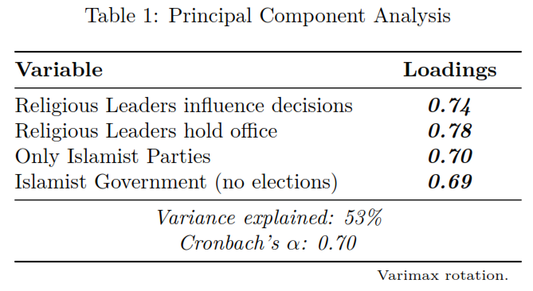
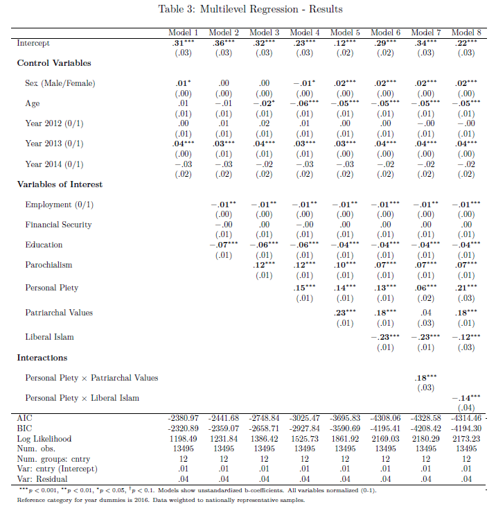
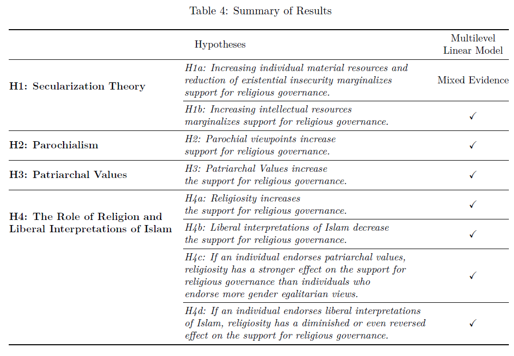
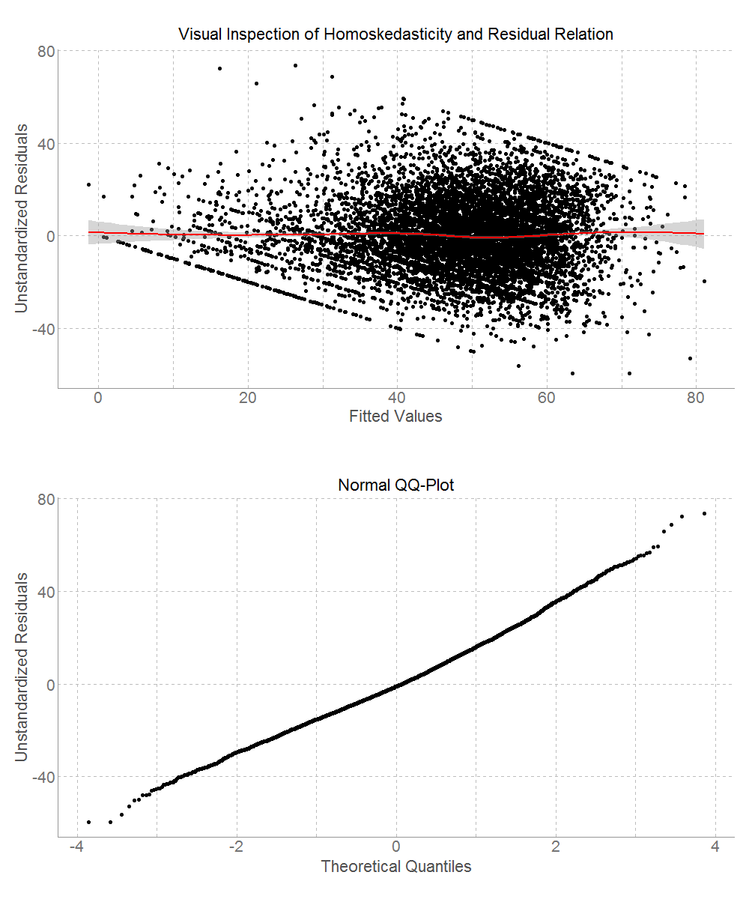
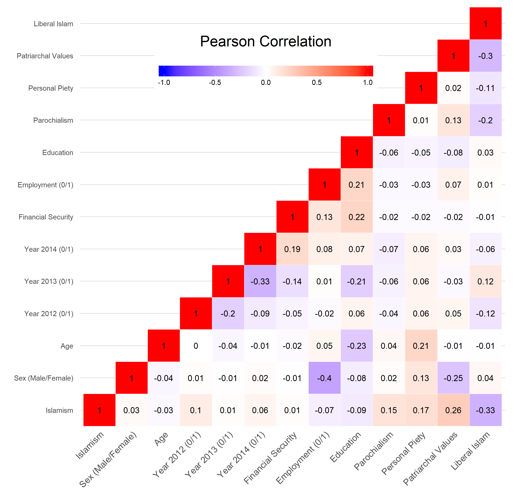

    

```{r xaringan-themer, include = FALSE}
#library(xaringanthemer)
# mono_accent(base_color = "#252525", link_color	= "rgb(198, 219, 239)")
```

<style>
.onehundredtwenty {
  font-size: 120%;
   }

<style>
.ninety {
  font-size: 90%;
   }

.eightyfive {
  font-size: 85%;
   }
   
.eighty {
  font-size: 80%;
   }
   
.seventyfive {
  font-size: 75%;
   }
   
.seventy {
  font-size: 70%;
   }
</style>


```{r setup, echo = F, include=F}
# include=FALSE
options(htmltools.dir.version = FALSE)

pacman::p_load(tidyverse, xaringan)

knitr::opts_chunk$set(echo = F, warning = F, error = F, message = F)

```


<br>
<br>
<br>
<br>
<br>
<br>
<br>
<br>

.onehundredtwenty[

Research Question:

> What role does religiosity play in support for religious governance? 

]


---

## Outline

.onehundredtwenty[

1. Theoretical Framework
2. Data & Methodology
3. Analysis & Results
4. Conclusions & Future Research

]


---

class: inverse, center, middle

## Theoretical Framework


---

## Theory

+ A commonly proposed explanation for the support for Political Islam is that devout Muslims simply
support religious governance out of their religious convictions

--

+ This proposed relationship falls in danger to become tautological and essentialist in nature, leading to explanations that Muslims support Political Islam *because they are Muslims*

--

Tessler describes the problematic nature of such arguments as this 

> "mistakenly assume[s] that there are clear and uncontested definitions of what constitute [...] 'Muslim' orientations" and "[...] ignores the significant differences that exist between Arab and Muslim countries, as well as the equally important individual-level variation that exists within countries [...] associated with age, education, class, gender, ethnicity, and residence." 

<center>

<i>Tessler, 2015, pp. 54-55</i>

</center>

---

<br>
<br>
<br>
<br>

**Definition:**

> *Islamism is a political ideology comprising various political movements and policies based on a political interpretation of the religion of Islam with the aim of giving Islam an institutionalized and authoritative status in social and political life, which may include the implementation of shari'a governance and/or the establishment of an Islamic state (some form of government consisting of explicitly religious individuals or parties) based on a collectivist Islamic identity.*


---

## Hypotheses

**Secularization Theory** *(Norris & Inglehart, 2011)*

> *H1a:* Increasing individual material resources marginalizes support for religious governance.

> *H1b:* Increasing intellectual resources marginalize support for religious governance.

--

**Parochialism**

> *H2:* Parochial viewpoints increase support for religious governance.

--

**Patriarchal Values**

> *H3:* Patriarchal Values increase the support for religious governance.

---


## Hypotheses

**The Role of Religiosity**

> *H4a:* Religiosity increases the support for religious governance.


> *H4b:* Liberal interpretations of Islam decrease the support for religious governance.

--

*Interactions*

> *H4c:* If an individual endorses patriarchal values, religiosity has a stronger effect on
the support for religious governance than for individuals who endorse more gender egalitarian
views.

--

> *H4d:* If an individual endorses liberal interpretations of Islam, religiosity has a
diminished or even reversed effect on the support for religious governance.


---

class: inverse, center, middle


## Data & Methodology


---

## Data & Methodology


+ Merging of the following datasets: 
  + Arabbarometer Survey Round 3 (data from 2014-2015)  
  + Arabbarometer Survey Round 4 (data from 2015-2016)  
  
+ In total 13.495 individual cases in 12 Arab countries
  + weighted with provided weight

---

### Dependent Variable - *Support for Islamism* 


*To what extent [do] you think these systems would be appropriate for your country?*

+ Religious leaders (imams, preachers, priests) should have influence over government decisions

+ Your country is better off if religious people hold public positions in the state 

+ A system governed by Islamic law without elections or political parties

+ A parliamentary system (based on Islamic law) in which only Islamist parties compete in parliamentary elections 

--


<center>



</center>

---

### Dependent Variable

<a href="https://github.com/favstats/godly_slides/raw/master/images/descriptives.png" target = "blank">  </a>

---

### Average Support by Country

<br>

<a href="https://github.com/favstats/godly_slides/raw/master/images/map_islamism_fin.png" target = "blank">  </a>


---

#### Independent Variables

*Secularization Theory*

+ Employment (0/1)
+ Financial Security
+ Education 
    
--
    
*Parochialism*

+ Do you think that the increase in global connectivity is a good or a bad thing for the society?
      
--
      
*Religiosity*

+ Personal Piety
 + Do you pray daily?
 + Do you listen to or read the Quran? 
+ Patriarchal Values
 + A married woman can work outside the home. 
 + In general, men are better at political leadership than women. 
 + University education for males is more important than university education for females.
 
---

#### Independent Variables

*Liberal Islam*

> The opinions of Islamic jurists and religious scholars differ and I want to ask to what extent you
agree or disagree with some of these issues?

+ Democracy is a system that contradicts the teachings of Islam.
+ Gender-mixed education should be allowed in universities. 
+ Women should wear modest clothes without needing to wear hijab. 

--

*Control Variables*

+ Sex (Male/Female)
+ Age
+ Year 2012 (0/1)
+ Year 2013 (0/1)
+ Year 2014 (0/1)


---

class: inverse, center, middle


## Analysis & Results

---

## Analysis

+ Individuals are nested into countries, so that application of *multilevel models* is suitable

+ ICC: 14.66% of the variance of Islamism is bound on the country-level

+ Sequential approach 
    + *Models 1-5* continually add one variable to the model
    + *Model 6* shows the main model with all variables
    + *Model 7-8* show estimated interaction effects
    
+ No severe violations of residual assumptions can be found
    

---


<center>

<a href="https://github.com/favstats/godly_slides/raw/master/images/regtable.png" target = "blank">  </a>


</center>

---

## Results - Main Effects

<a href="https://github.com/favstats/godly_slides/raw/master/images/coefplot.png" target = "blank">  </a>


---

## Results - Interaction Effects

<br>

<a href="https://github.com/favstats/godly_slides/raw/master/images/interactions.png" target = "blank">  </a>


---

class: inverse, center, middle

## Conclusions & Future Research

---

<br>

<a href="https://github.com/favstats/godly_slides/raw/master/images/summary.png" target = "blank">  </a>


---

## Conclusions & Future Research

+ Financial Security shows no significant effect, whereas increased education and unemployment do

--

+ Parochialism and Patriarchal values both seem to increase the support for religious governance

--

+ Religion matters and it matters *a great deal*
    + However: Liberal interpretations of Islam decrease the support for religious governance
    + The moderating effect Liberal Islam and Patriarchal Values is *strongest* for the most religious individuals

--
    
+ Further studies in the field should account for the very diverse interpretations and multidimensionality of religion and religiosity in that context. 

--

+ Much variation has been found between countries
    + Future research should consider case-studies of individual countries

---

class: inverse, center, middle


## Thanks for Listening!

Full Paper: <a href='http://www.academia.edu/36488238/Godly_Governance_A_Cross-National_Examination_of_Religious_Politics_in_Arab_Muslim-Majority_Countries'>Godly Governance</a>

Slides: <a href='https://godly-governance.netlify.com'>godly-governance.netlify.com </a>

Code and Data on <a href='https://github.com/favstats/GodlyGovernance'>GitHub</a>


---

## References

*Norris, P., & Inglehart, R. (2011). Sacred and secular: Religion and politics worldwide. Cambridge University Press.*

*Tessler, M. (2015). Islam and Politics in the Middle East: Explaining the Views of Ordinary Citizens. Indiana University Press.*


---

class: inverse, center, middle

## Appendix


---

class: center, middle


<a href="https://github.com/favstats/godly_slides/raw/master/images/diagnostics.png" target = "blank">  </a>

---


class: center, middle

<a href="https://github.com/favstats/godly_slides/raw/master/images/heatmap.png" target = "blank">  </a>